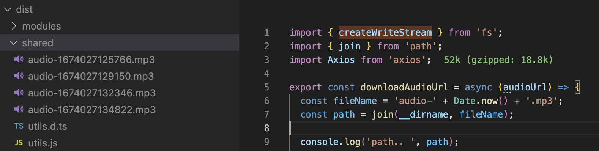

## Scenario

We are assuming at the same time we have many request to download audio. We'll push audio url to queues then download it one by one.
To assume at the same time we have many request to download audio, we'll create 1 array data and use for loop push audio url to queue.

```
const urls = [
      'https://www.soundhelix.com/examples/mp3/SoundHelix-Song-1.mp3',
      'https://www.soundhelix.com/examples/mp3/SoundHelix-Song-2.mp3',
      'https://www.soundhelix.com/examples/mp3/SoundHelix-Song-3.mp3',
      'https://www.soundhelix.com/examples/mp3/SoundHelix-Song-4.mp3',
    ];
    // Push audio url to queue
    for (const audioUrl of urls) {
      await this.queue.add('audio_downloader_job_name', {
        audioUrl: audioUrl,
      });
    }
```

To trigger queues we'll call endpoint: http://localhost:3000/audio-downloader

## Result

Audio files downloaded at: /usr/src/app/dist/shared/ (path in docker container)



## Run

docker compose up --build or docker compose up

## Queues

https://docs.nestjs.com/techniques/queues
